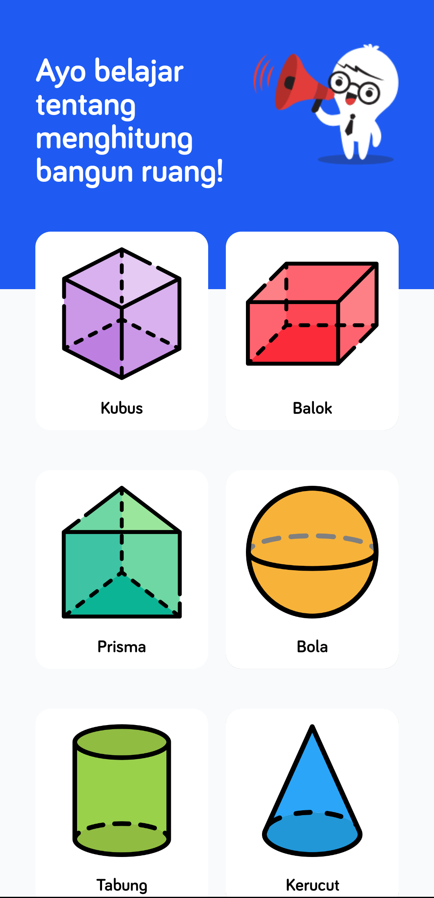

# Si Boto Bangun

Si Boto Bangun is an Android application that helps users to calculate the volumes and areas of various 2D and 3D geometric shapes with ease.

## Features

- Calculate the area of 2D shapes such as squares, rectangles, triangles, and circles.
- Calculate the volume of 3D shapes such as cubes, spheres, cylinders, and cones.
- User-friendly interface with step-by-step input guidance.

## Screenshots

Here are some screenshots of the application:


*Home Screen*


*Choose Shapes*


*2D Shapes Calculation*


*3D Shapes Calculation*

## Getting Started

### Prerequisites

- Android Studio installed
- Java JDK 17

### Installation

Clone the repository:

```sh
git clone https://github.com/yourusername/kalkulator-bangun-ruang.git
```

## Contributing

Contributions are welcome! Please create a pull request with a clear description of your changes and how they address the issue or feature.

## License

This project is licensed under the MIT License. See the `LICENSE` file for more details.

## Contact

If you have any questions or feedback, feel free to contact us at [amsalsiregar12@gmail.com].

---

Enjoy calculating with ease!
